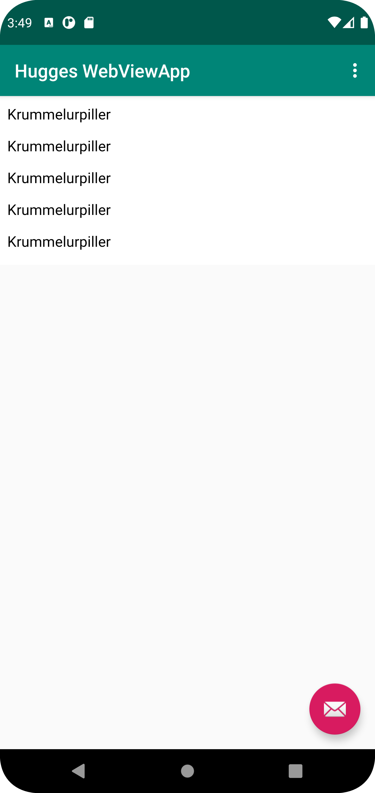

# Rapport

Jag gjorde en sträng som är appens namn och lade sedan till den i XML-filen som heter activity_main.xml. Jag lade till en webview i samma XML-fil och länkade en extern och en intern sida, som jag har gjort själv. Dessa två sidor visas i webview. Jag satte även på javascript och internet för denna app.


```
    <uses-permission android:name="android.permission.INTERNET" />        

        my_webview.loadUrl("https://www.his.se/");
        my_webview.loadUrl("file:///android_asset/index.html");
        my_webview = (WebView) findViewById(R.id.my_webview);

        WebSettings webSettings = my_webview.getSettings();
        webSettings.setJavaScriptEnabled(true);
```

I detta kodexempel så sätter jag på internet och javascript. Jag hittar även efter den webview jag har skapat och lägger till de länkar som ska visas i den.




